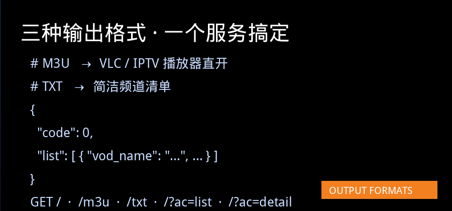
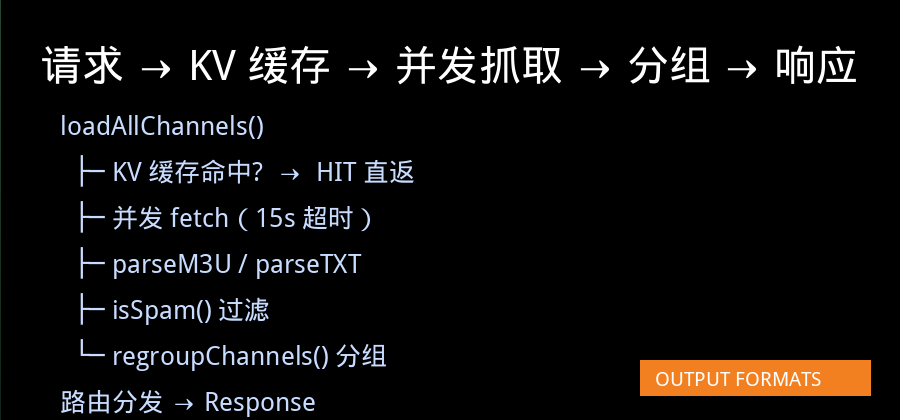

# Cloudflare Worker - 直播源聚合 / 引流注入

一个运行在 Cloudflare Workers 上的直播源聚合服务，支持多源抓取、KV 缓存、自动分组、引流注入，兼容 IPTV 播放器常用的 M3U / TXT 输出格式以及类苹果 CMS 的 JSON API。

---

<p align="center">
  
</p>

<p align="center">
  
  
  
  
  
</p>

---

## 📁 文件结构

| 文件 | 说明 |
|------|------|
| `worker.js` | **生产代码**（已填入实际配置：直播源、引流节目等） |
| `worker.template.js` | **模板文件**（配置区留空/注释，供参考或二次部署） |
| `wrangler.toml` | Cloudflare Worker 部署配置 |

---

## 🚀 功能特性

| 特性 | 说明 |
|------|------|
| 🔀 **多源聚合** | 从多个远程地址抓取直播源（支持 `.m3u` / `.txt`，也可自动判断格式） |
| ⚡ **KV 缓存** | 接入 Cloudflare KV，缓存 10 分钟，避免冷启动重复抓取 |
| 🗂️ **自动分组** | 基于标题关键词自动归入「央视 / 卫视 / 体育 / 影视」等分类 |
| 📢 **引流注入** | 在频道列表顶部固定插入自定义推广节目（`PROMO_LIST`） |
| 🧹 **垃圾过滤** | 关键词黑名单过滤广告 / 无效频道 |
| 📦 **多格式输出** | M3U / TXT / JSON，兼容各类 IPTV 播放器 |
| 🌐 **CORS 支持** | 全开放跨域头，可直接被前端 / 播放器调用 |
| 🔧 **环境变量覆盖** | Dashboard 设置 `SOURCE_URLS`、`ENABLE_PROMO` 等动态覆盖硬编码 |

### 路由一览

| 路径 | 说明 |
|------|------|
| `GET /` | 首页 JSON（分类 + 频道列表） |
| `GET /?ac=list&t=分组名&pg=1` | 分类分页列表 |
| `GET /?ac=detail&ids=ch_0,ch_1` | 频道详情 |
| `GET /m3u` 或 `/live.m3u` | M3U 播放列表 |
| `GET /txt` 或 `/live.txt` | TXT 频道列表 |

---

## ✨ 效果预览

<p align="center">
  
</p>

> 左：M3U 播放列表（VLC / IPTV 播放器直接打开）｜ 中：TXT 频道列表 ｜ 右：首页 JSON API

---

## 👤 关于作者

<p align="center">
  <table align="center" style="border-collapse:separate;border-spacing:0;overflow:hidden;">
    <tr>
      <td align="center" width="200" valign="middle"
          style="background:linear-gradient(135deg,#1f2937,#374151);padding:28px 20px;border-radius:16px 0 0 16px;">
        
      </td>
      <td align="left" valign="middle"
          style="background:#f8fafc;padding:24px 28px;border-radius:0 16px 16px 0;">
        <div style="font-size:18px;font-weight:700;color:#111827;">
          一个不识码的中年男人 🧓👨‍💻
        </div>
        <div style="font-size:13px;color:#6b7280;margin-top:4px;">
          正经西装领带，不正经的只有思路。
        </div>
        <div style="margin-top:12px;font-size:13.5px;line-height:1.7;color:#374151;">
          💡 <strong>作者自述</strong>：本职工作跟代码没半点关系，纯属闲着也是闲着，拿 Cloudflare Workers 实现TV直播源自由。<br/>
          这个直播源聚合服务，就是一边想一边跟AI结对编程"磕"出来的——能跑就算成功，跑崩了就刷新重试。<br/>
          直播源不是最优，但好在 <strong>能用、好部署、改配置就能跑</strong>，适合同样想折腾又不想深陷 Node 生态的同学。
        </div>
        <div style="margin-top:12px;font-size:13px;color:#4b5563;">
          如果这个项目对你有帮助，欢迎 ⭐ Star / Fork，也欢迎提 Issue（作者承诺尽量看、不一定改 😂）。
        </div>
      </td>
    </tr>
  </table>
</p>

---

## 📝 配置说明

### 用户配置区（仅需修改此部分）

```javascript
// 直播源列表
const SOURCE_URLS = [
    { url: "https://example.com/live1.m3u", format: "m3u" },
    { url: "https://example.com/live2.txt", format: "txt" },
    { url: "https://example.com/auto-detect" }, // 不指定 format 自动判断
];

// 引流节目（置顶）
const PROMO_LIST = [
    {
        title: "宣传片1",
        url:   "https://example.com/promo1.mp4",
        pic:   "https://example.com/promo1.jpg",
        group: "推流信息",
        from:  "1",
        remarks: "置顶引流",
    },
];

// 垃圾关键词过滤
const SPAM_KEYWORDS = ["广告", "注意事项", "加群", /* ... */];

// 自动分组规则（按优先级从上到下匹配）
const REGROUP_RULES = [
    { group: "📺 高清", keywords: ["4K", "8K", "高清"] },
    { group: "📺 央视", keywords: ["CCTV", "央视", "中央"] },
    // ... 更多规则
];
```

### 环境变量（可选，Dashboard 设置）

| 变量名 | 说明 | 示例 |
|--------|------|------|
| `SOURCE_URLS` | JSON 字符串，覆盖硬编码的直播源 | `[{"url":"https://...m3u"}]` |
| `ENABLE_PROMO` | 是否注入引流节目 | `"true"` / `"false"` |
| `FALLBACK_LOGO_BASE` | 自定义台标兜底域名 | `https://your-logo-cdn.com` |

---

## 🔧 部署指南

### 前置条件

1. 注册 [Cloudflare](https://cloudflare.com) 账号并登录
2. 安装 Wrangler CLI：`npm install -g wrangler`
3. 登录：`wrangler login`

### 步骤

```bash
# 1. 克隆/进入项目目录
cd your-project-dir

# 2. 创建 KV 命名空间（首次部署）
wrangler kv:namespace create "KV"

# 3. 将返回的 ID 填入 wrangler.toml（自动 provisioning 模式下可跳过）
# [[kv_namespaces]]
# binding = "KV"
# id = "你的-namespace-id"

# 4. 部署
wrangler deploy
```

部署成功后，Wrangler 会输出一个 Worker URL（如 `https://live-aggregator.xxx.workers.dev`），即可访问。

### Dashboard 部署

1. 进入 Cloudflare Dashboard → **Workers & Pages → Create Worker**
2. 粘贴 `worker.js` 代码
3. 在 **Settings → Bindings** 中添加一个 KV Namespace，变量名填 `KV`
4. **Save & Deploy**

---

## 📡 API 使用示例

```bash
# 首页（分类 + 频道列表）
curl https://your-worker.workers.dev/

# 获取 M3U 播放列表（可直接在 VLC / IPTV 播放器中打开）
curl https://your-worker.workers.dev/m3u

# 获取 TXT 格式
curl https://your-worker.workers.dev/txt

# 分页获取某分类频道
curl "https://your-worker.workers.dev/?ac=list&t=📺%20央视&pg=1&limit=20"

# 获取频道详情
curl "https://your-worker.workers.dev/?ac=detail&ids=ch_0,ch_5"
```

---

## 🏗️ 架构说明

```
请求进入
   │
   ▼
loadAllChannels()
   │
   ├── 1. 尝试读取 KV 缓存（10分钟有效期）
   │       ├── HIT → 直接返回缓存的频道列表
   │       └── MISS/EXPIRED → 继续下一步
   │
   ├── 2. 并发抓取所有 SOURCE_URLS
   │       ├── fetchWithTimeout（15秒超时）
   │       ├── parseM3U() / parseTXT() 解析
   │       └── isSpam() 过滤垃圾频道
   │
   ├── 3. regroupChannels() 自动分组
   │
   └── 4. waitUntil() 异步写回 KV（不阻塞响应）
        │
        ▼
   路由分发（/m3u、/txt、/?ac=list、/?ac=detail、/）
        │
        ▼
     Response
```

<p align="center">
  
</p>

---

## ⚙️ 关键常量

| 常量 | 默认值 | 说明 |
|------|--------|------|
| `CACHE_TTL_MS` | 10 分钟 | 内存级缓存有效期 |
| `KV_TTL_SECONDS` | 600 秒 | KV 存储 TTL |
| `FETCH_TIMEOUT_MS` | 15 秒 | 单源抓取超时 |
| `DEFAULT_PAGE_SIZE` | 20 | 默认分页大小 |
| `MAX_RETURN_LIMIT` | 500 | 单分类最大返回条数 |
| `FALLBACK_LOGO_BASE` | `https://epg.112114.xyz/logo` | 台标兜底域名 |

---

## ⚠️ 注意事项

1. **KV 绑定**：确保 Worker 已绑定名为 `KV` 的 KV Namespace，否则会自动降级为每次直接抓取
2. **免费额度**：Cloudflare Workers 免费版每天 10 万次请求，KV 免费版每天 10 万次读 / 1,000 次写，注意用量
3. **超时限制**：单次 Worker 执行上限 30 秒（CPU），抓取超时设为 15 秒，避免雪崩
4. **直播源稳定性**：上游源失效时会在日志中输出错误，不影响其他源的返回
5. **引流合规**：PROMO_LIST 中的内容请确保版权合规

---

## 📄 License

MIT
